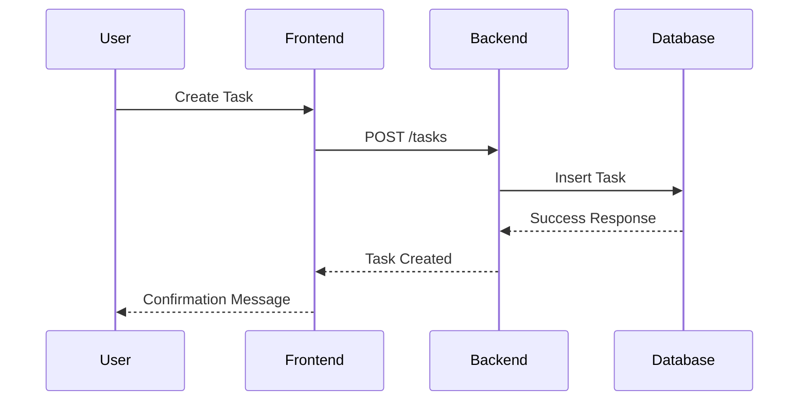

# Sample Node.js Application

This document provides an overview of a sample Node.js application, including its architecture and workflow. The architecture is visualized using Mermaid diagrams.

---

## Application Overview

The sample Node.js application is a RESTful API that allows users to manage tasks. It includes the following components:

- **Frontend**: A React-based user interface.
- **Backend**: A Node.js server using Express.js.
- **Database**: A MongoDB database for storing tasks.

---

## Architecture Diagram

```mermaid
graph TD
    A[Frontend (React)] -->|HTTP Requests| B[Backend (Node.js/Express)]
    B -->|Database Queries| C[Database (MongoDB)]
```

---

## Workflow Diagram



---

## Reference Links

- [Node.js Documentation](https://nodejs.org/en/docs/)
- [Express.js Guide](https://expressjs.com/)
- [MongoDB Documentation](https://www.mongodb.com/docs/)
- [Mermaid Documentation](https://mermaid-js.github.io/mermaid/)
